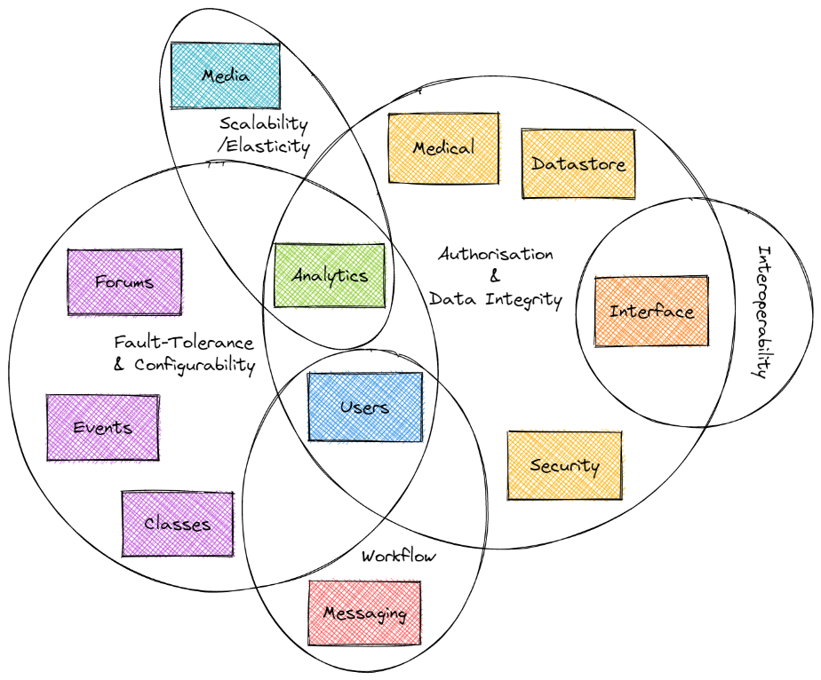

[> Home](../README.md)   [> Problem Background](README.md)
[< Prev](BusinessGoalsDriversAndRequirements.md)  |  [Next >](ActorsActionsAndSignificantScenarios.md)

---

# Architecture Analysis

## Key Architecture Characteristics

By identifying the key architecture characteristics for this solution we can then identify the *least-worst* solution. Best practice is to identify no more than seven. These, along with the implicit architecture characteristics, will then feed into the overall architecture of the Farmacy Family system.

### Candidate Architecture Characteristics

performance    responsiveness    availability    fault-tolerance    scalability/elasticity    data integrity    data consistency    adaptability    extensibility    interoperability    concurrency    deployability    testability    abstraction    workflow    configurability    recoverability    reliability    authorisation    agility    cost    domain-partitioning    evolvability    integration

### Selected Architecture Characteristics

| Top 3 | Characteristic               | Source                                                       |
| ----- | ---------------------------- | ------------------------------------------------------------ |
| Y     | Interoperability/Integration | Integration with Farmacy Foods (converting Foods transactional customers to Family engaged customers, and analytics feedback), and with dieticians and clinics. |
|       | Data Integrity               | Generate analytical data from medical information, geographical data, etc, to demonstrate the benefits of FF, improve fridge supplies for Foods, and exchange analytical data with clinics. Must be correct as is medical data. |
|       | Scalability/Elasticity       | Analytics domain, and some other domains like reference material / media, likely to require more resources (especially computational) at different times. |
| Y     | Configurability              | Customers have fine-grained control what other customers can see on their profile, and give permissions for e.g. clinics to access their medical data. |
| Y     | Authorisation                | Although normally an implicit architecture characteristic (see below) this is promoted here due to clinician and dietician needing authorisation from a customer user to access medical information. |
|       | Workflow                     | Transactional Foods customers must be onboarded as engaged Family customers, with a completed profile. |
|       | Fault-Tolerance              | Community is the most important part of Family. It consists of many aspects, e.g. forums, events, classes, and so each community subdomain must be fault-tolerant of the others else one small problem could take the whole community domain down. |

### Implicit Architecture Characteristics

The following are a bedrock of architecture characteristics. They may not affect the *structure* but will feed into the overall architecture.

- Feasibility (cost/time)
- Security, authentication and authorisation
- Maintainability
- Simplicity

---

## Architectural Quanta

Of the characteristics identified above, do they apply to the whole system or are there clear sets applying to different parts of the system?

### Table View

| Identified Domains                                    | Sub-domains and Considerations                               | Applicable Architectural Characteristics                     | Strategic Domain |
| ----------------------------------------------------- | ------------------------------------------------------------ | ------------------------------------------------------------ | ---------------- |
| Users                                                 | Customer, Preferences, Profile (Personal & Medical), Dietician, Clinic, Administrator?, Onboarding, Integration (Farmacy Foods) | - Interoperability (moved to Interface) - Configurability - Authorisation - Workflow - Fault-Tolerance - Data-Integrity | Supportive       |
| Security                                              | Authentication, Authorisation                                | - Authorisation - Data Integrity -Interoperability (moved to Interface) | Generic          |
| Data Store                                            | Database, Interface                                          | - Data Integrity - Authorisation                        | Generic          |
| Class (localised, temporal)                           |                                                              | - Configurability - Fault Tolerance                     | Core             |
| Event (in-person, localised, temporal)                |                                                              | - Configurability Fault Tolerance                       | Core             |
| Forum (localised, temporal)                           |                                                              | - Configurability - Fault Tolerance                     | Core             |
| Reference Material / Media (global, reference/static) | Media Library, General Wellness                              | - Scalability/Elasticity                                     | Generic          |
| Analytics (geographical trend analysis)               | Geographical, Engagement?, Integration (Farmacy Foods), Reporting | - Fault Tolerance, - Configurability - Scalability/Elasticity - Authorisation -Data-Integrity | Core             |
| Messaging                                             | Email, Message, Notification, Subscription?                  | - Workflow                                                   | Supportive       |
| Medical                                               | Test, Result                                                 | - Authorisation - Data-Integrity                        | Core             |
| Interface                                             |                                                              | - Interoperability - Authorisation - Data-Integrity | Supportive       |

### Venn Diagram

This diagram illustrates that although there are many shared characteristics, even those that are shared are shared by domains that do not themselves overlap. This leads us to a distributed architecture with deployment, backup and disaster recovery needing to take into account these characteristics. These characteristics may also inform further granularity of these domains.

---

## System Granularity

A breakdown of the key granularity analysis and links to ADRs.

### Users

| Functionality | Volatility | Scalability             | Fault Tolerance                | Data Security | Data Transactions              | Data Dependencies            | Workflow             |
| ------------- | ---------- | ----------------------- | ------------------------------ | ------------- | ------------------------------ | ---------------------------- | -------------------- |
| Customer      | Low        | Unlikely to be required | Split required                 | High          | Profile, Onboarding, Message   | Security, Messages           | Separate             |
| Dietician     | Low        | Unlikely to be required | Could be merged with Clinic    | High          | Dietician, Message             | Profile, Messages            | Similar to Clinic    |
| Clinic        | Low        | Unlikely to be required | Could be merged with Dietician | High          | Clinic, Message                | Dietician, Messages, Profile | Similar to Dietician |
| Administrator | Low        | Unlikely to be required | Split required                 | High          | Manage users, manage community | (all above)                  | Separate             |

[ADR: We-will-separate-the-user-domain](../4.ADRs/011-We-will-separate-the-user-domain.md)

### Security

| Functionality  | Volatility | Scalability             | Fault Tolerance                                              | Data Security | Data Transactions                                    | Data Dependencies | Workflow |
| -------------- | ---------- | ----------------------- | ------------------------------------------------------------ | ------------- | ---------------------------------------------------- | ----------------- | -------- |
| Authentication | Low        | Unlikely to be required | Don't want one without the other, could be merged with Authorisation | High          | User email/username, User password (hashed/salted)   | User              | Separate |
| Authorisation  | Low        | Unlikely to be required | Don't want one without the other, could be merged with Authentication | High          | User Roles / Permissions, User authentication status | User              | Separate |

[ADR: Combine Authentication and Authorisation into one Security Domain](../4.ADRs/012-We-will-combine-authentication-and-athorisation.md)

### Community

| Functionality    | Volatility | Scalability  | Fault Tolerance                                              | Data Security | Data Transactions | Data Dependencies | Workflow                              |
| ---------------- | ---------- | ------------ | ------------------------------------------------------------ | ------------- | ----------------- | ----------------- | ------------------------------------- |
| Administer Forum | Medium     | Low usage    | Split required from customer functionality                   | High          | Forum             | Forum, Admin      | Similar to Administer Event and Class |
| Access Forum     | Low        | Medium usage | Split required from admin functionality, could be merged with Write | Low           | Forum             | Forum, Customer   | Similar to Access Event and Class     |
| Write to Forum   | Low        | Medium usage | Split required from admin functionality, could be merged with Access | Low           | Forum             | Forum, Customer   | Similar to Write to Event and Class   |
| Administer Event | Medium     | Low usage    | Split required from customer functionality                   | High          | Event             | Event, Admin      | Similar to Administer Forum and Class |
| Access Event     | Low        | Medium usage | Split required from admin functionality, could be merged with RSVP | Low           | Event             | Event, Customer   | Similar to Access Forum and Class     |
| RSVP to Event    | Low        | Medium usage | Split required from admin functionality, could be merged with Access | Low           | Event             | Event, Customer   | Similar to Write to Forum and Class   |
| Administer Class | Medium     | Low usage    | Split required from customer functionality                   | High          | Class             | Class, Admin      | Similar to Administer Event and Forum |
| Access Class     | Low        | Medium usage | Split required from admin functionality, could be merged with Take | Low           | Class             | Class, Customer   | Similar to Access Event and Forum     |
| Take Class       | Low        | Medium usage | Split required from admin functionality, could be merged with Access | Low           | Class             | Class, Customer   | Similar to Write to Event and Forum   |

[ADR: Community will be split into admin and customer functionality and provide an interface to classes, forums and events](../4.ADRs/013-We-will-split-community-domain.md)

### Reference Material / Media 

| Functionality        | Volatility | Scalability  | Fault Tolerance                            | Data Security | Data Transactions | Data Dependencies | Workflow          |
| -------------------- | ---------- | ------------ | ------------------------------------------ | ------------- | ----------------- | ----------------- | ----------------- |
| Administer Media     | Medium     | Low usage    | Split required from customer functionality | Medium        | Media             | Media, Admin      | Separate          |
| View Available Media | Low        | Medium usage | Split required from admin functionality    | Low           | Media             | Media, Customer   | Similar to Access |
| Access Media         | Low        | Medium usage | Split required from admin functionality    | Low           | Media             | Media, Customer   | Similar to View   |

[ADR: Media will be split into Media Administration and Media Access](../4.ADRs/014-We-will-split-media-domain.md)

### Analytics 

| Functionality                  | Volatility | Scalability | Fault Tolerance                         | Data Security | Data Transactions  | Data Dependencies | Workflow |
| ------------------------------ | ---------- | ----------- | --------------------------------------- | ------------- | ------------------ | ----------------- | -------- |
| Run Analytics                  | High       | Required    | Should be split from Admin              | High          | MANY               | MANY              | Separate |
| Administer/Create Analytics    | High       | Required    | Should be split from Run & Store/Access | Medium        | Analytics Settings | MANY              | Separate |
| Store/Access Analytics Results | High       | Required    | Should be split from Admin              | High          | Analytics Storage  | Analytics Storage | Separate |

[ADR: Analytics will be split into Administration, Run and Store/Access](../4.ADRs/015-We-will-split-analytics-domain.md)

### Messaging

| Functionality             | Volatility | Scalability  | Fault Tolerance                                   | Data Security | Data Transactions                                            | Data Dependencies                         | Workflow |
| ------------------------- | ---------- | ------------ | ------------------------------------------------- | ------------- | ------------------------------------------------------------ | ----------------------------------------- | -------- |
| Notification              | Low        | Medium usage | Split required from Subscription                  | Low           | Notification (inc. status), Message status, Subscription event | User, Subscription, Message, Notification | Separate |
| Message                   | Low        | Medium usage | Split required from Subscription                  | High          | User Id, Message, Message Id                                 | User (Customer, Dietician), Message       | Separate |
| Email                     | Low        | Medium usage | Split required from Subscription                  | Medium        | User email address                                           | User                                      | Separate |
| Subscription (add/remove) | Medium     | Low usage    | Split required from Notification, Message & Email | Low           | User Id, Forum/Event/Class Id, Subscription                  | User, Forum, Event, Class, Subscription   | Separate |

[ADR: Messaging will be split into Subscription, Message, Notification and Email](../4.ADRs/016-We-will-split-messaging-domain.md)

### Medical

| Functionality          | Volatility | Scalability  | Fault Tolerance              | Data Security | Data Transactions     | Data Dependencies              | Workflow       |
| ---------------------- | ---------- | ------------ | ---------------------------- | ------------- | --------------------- | ------------------------------ | -------------- |
| Medical Administration | Medium     | Medium usage | Split required from customer | High          | Test, Result          | Test, Result, Clinic, Customer | Result overlap |
| Add/Update Result      | Medium     | Medium usage | Split required from admin    | High          | Test, User Id, Result | Test, Result, User             | Result overlap |

[ADR: Medical will be split into Admin and Customer](../4.ADRs/017-We-will-split-medical-domain.md)

### Data Store

See [Datastore Solution Overview](../2.SolutionBackground/DataStore.md).

---

## Integration points for Farmacy Family

| System        | Direction           | Elements         | Reasoning                                                    | Managed Through                                              |
| ------------- | ------------------- | ---------------- | ------------------------------------------------------------ | ------------------------------------------------------------ |
| Farmacy Foods | 2-way               | Customer         | So that Farmacy Foods can identify transactional customers who have not become Engaged customers of Farmacy Family in order to retry engagement. | Interface, Authentication, Authorisation                     |
| Farmacy Foods | Family to Foods     | Analytics        | Optimise the content of geographically located smart fridges (medical data linked to geographical location), optimise engagement programme for transactional customers (onboarding analytics to inform the engagement programme for transactional customers of Farmacy Foods). | Interface, Authentication, Authorisation                     |
| Farmacy Foods | Foods to Family     | Geo & Order Data | So that Farmacy Family can run analytics on geolocation (orders, fridges, etc) and order data, the results of which can be used by Farmacy Family to optimise processes (e.g. Fridge stock). | Interface, Authentication, Authorisation                     |
| Dietician     | Family to Dietician | Customer Profile | Dieticians can be given permission to access customer medical information in the customer profile (inherit permission from an associated clinic). | User (Dietician linked to Clinic), Authentication, Authorisation |
| Dietician     | 2-way               | Message          | Dieticians and customers can message each other.             | User (Dietician), Authentication, Authorisation              |
| Clinic        | Family to Clinic    | Customer Profile | Clinics can be given permission to access customer medical information in the customer profile. | User (Dietician linked to Clinic), Authentication, Authorisation |
| Clinic        | 2-way               | Message          | Clinics and customers can message each other.                | User (Dietician linked to Clinic), Authentication, Authorisation |
| Clinic        | Family to Clinic    | Analytics        | Clinics can be given permission to access results of Farmacy Family Analytics. | User (Dietician linked to Clinic), Authentication, Authorisation |
| Clinic        | Clinic to Family    | Data             | Clinics can provide data for Farmacy Family to run analytics on. | API/Automatic: Interface, Manual entry/upload: User (Dietician linked to Clinic), Authentication, Authorisation |

[ADR: An Interface will be used for system-system integration](../4.ADRs/018-use-interface-for-system-system-integration.md)

[ADR: Authentication and Authorisation of users will be used for human-system integration](../4.ADRs/019-use-auth-for-human-system-integration.md)

---

## Architectural Governance

Compliance with Architectural decisions and designs is as important as compliance with security and code structure best practices. The latter are typically monitored using automated testing, audits, code reviews, acceptance criteria and penetration tests. The former is often forgotten and not even included in the acceptance criteria in a user story.

### Fitness Functions

Architectural Fitness Functions will be implemented in the Farmacy Family system in order to govern compliance to architectural decisions and designs. Non-compliance will need to be fixed (or if there is good reason the decision recorder in an ADR and the Fitness Functions updated), in the same way as a failing test.

There are various options for implementing these functions, and either one option or a mixture could be optimal for this system. In AWS the following are some of the options to investigate:

- CloudWatch - notifications of non-compliance can be sent as emails, etc
- Kibana - a data visualization and exploration tool used for log and time-series analytics, application monitoring, and operational intelligence use cases
- Lambdas - it may be optimal to write our own Fitness Functions as AWS Lambdas

---

## Next Steps:

- [x] Make decisions and record in ADRs about system granularity.
- [ ] Create diagrams of the granularity decided above.
- [ ] Investigate options for Fitness Functions.

---

[> Home](../README.md)   [> Problem Background](README.md)
[< Prev](BusinessGoalsDriversAndRequirements.md)  |  [Next >](ActorsActionsAndSignificantScenarios.md)
