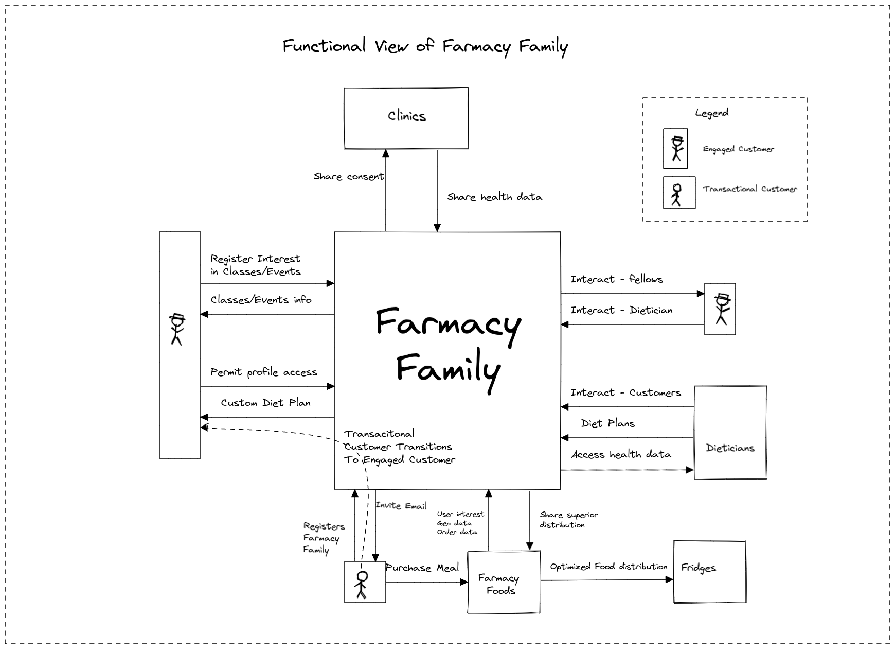

[> Home](../README.md)   [> Problem Background](README.md)

---

# Business Goals and Drivers

## Business Goals

1. Develop relationships between engaged customers and nurture those relationships.

2. Convert transactional customers to engaged customers.

3. Generate analytical data from medical information to demonstrate the benefits of Farmacy Foods.

Thus, the overall goal of Farmacy Family is to connect, gather, analyze and communicate. 

## Background

Farmacy Family is an enhancement of the existing Farmacy Foods system (designed by Arch Colider) from the first Kata exercise that adds tighter engagement with their customers.

### Kwasu Osei, The Founder, Farmacy Food

Kwaku Osei is the founder of Farmacy Food, a a tech-enabled healthy food startup that to seeks to make health and wellness radically affordable and accessible, and Cooperative Capital, a community-based private equity fund that enables residents to pool their money together to make promising investments within their community.

## Business Drivers 

1. Improved use of analytics driven through the new integration
of Farmacy Family will help gather new investors and prove
better dietary outcomes in member communities.
2. Food being wasted from having the wrong mix of foods in a particular fridge.

## Opportunities

# Requirements and Engagement model

## Engagement Models

### Clients

Hundreds, separated by distinct geographic zones. Additionally, different clusters of customers frequently consolidate around similar dietary requirements. Mostly targeting low income, elderly, and first responders.

Building a community, education, increased awareness

### Clinics 

Work with clinics to establish baseline tests for clients

- Gather results
- Test every 3 months
- Analyze results 
- Demonstrate any change in their overall health
- use this info to gain investors and additional support and help

### Dieticians

- Farmacy Foods supported generic advice from dieticians. Farmacy Family
will support one-on-one advice for engaged customers
- Regular contact via messages
- Selective access to medical information about the customer from a partner
clinic

### Family Foods

- Farmacy Family needs to know which Transactional Customers (and their
information) are not part of Farmacy Family (Engaged Customer) to start the
onboarding process for those customers
- Farmacy Foods needs to know which transactional customers are Engaged Customers

## Architecturally Significant Business Requirements

| # | Significant Architectural Requirements | Business Goal |
|----|----|----|
| 1 | Customer profiles | 1 |
| 2 | Geographical trend analysis  | 1 |
| 3 | Community engagement  | 1 |
| 4 | eDietician advice & interaction  | 2 |
| 5 | Improve food Distribution  |  |
| 6 | Medical profile information  | 3 |
| 7 | Profile customization  | 1 |
| 8 | Third party relationships   | 2 |
| 9 | Holistic UX   | 1, 2 |
| 10 | Customer engagement   |  2 |

### 1. Customer profiles

Add a new system to manage customer profiles, allowing community
engagement, personalization around preferences and dietary needs

### 2. Geographical trend analysis

Support geographical trend analysis to hone Farmacy Family’s ability to
optimize the foods delivered to fridges (an additional integration point to
Farmacy Foods)

### 3. Community engagement

Support both push and pull models for community engagement. In other
words, Farmacy Family will manage forums,emails, and create connections
between similar demographics. Farmacy Family needs transactional member
information for outreach purposes. The engagement model includes
subscriptions, forums, reference material, class information, and other media
that supports Food-as-medicine

### 4. eDietician advise & interaction

eDietian can access customer profile to improve advice and
monitoring of customers. Additionally, the customer and dietitian can
interact via messages.

### 5. Improve food distribution

Farmacy Family wants to improve the distribution and potential food
waste from having the wrong mix of foods in a particular fridge.

### 6. Medical profile information

Farmacy Family will include medical profile information and the
ability to share information with medical service providers.

### 7. Profile customization

Farmacy Family customers can customize how much profile
information they want to allow the community to see, at a fine grained
level.

### 8. Third party relationships

Farmacy Family has relationships with third party providers (clinics,
doctors, etc) that have access to more analytical data to improve
engagement (for example, regional dietary observations).

### 9. Holistic UX

Add Farmacy Family user interface to existing Foods interface, which
is currently a Reactive monolith. Create a holistic UX for both food and
Farmacy Family to support engagement model.

### 10. Customer engagement

When a transactional customer purchases a meal, Farmacy Family will generate an email elucidating additional benefits available for becoming an engaged customer.

## Significant Non-Functional requirements 

1. The new system must seamlessly incorporate into Farmacy Foods.

## Functional View of the Requirements

------

[> Home](../README.md)   [> Problem Background](README.md) 

