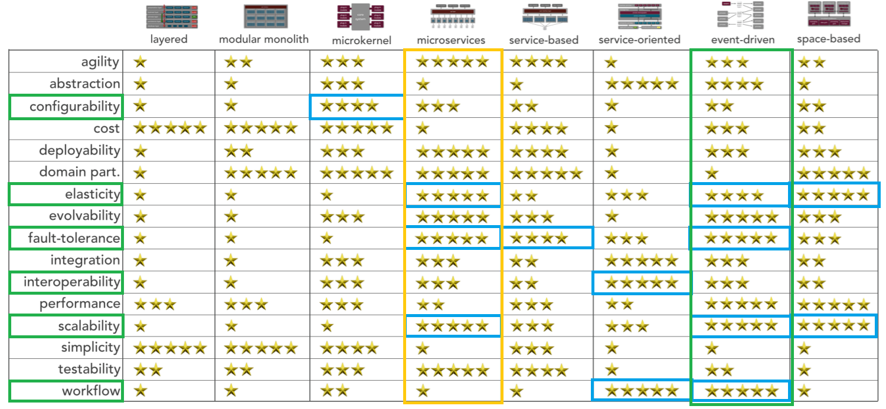

[> Home](../README.md)    [> Solution Background](README.md)
[< Prev](ArchitecturePrinciples.md)  |  [Next >](SystemApproach.md)

---

# Overall Architecture Style Analysis

## Identified Key Architectural Characteristics

The [key architectural characteristics](../1.ProblemBackground/ArchitectureAnalysis.md) that were identified help us to select and overall architecture style. The top three are shown in bold and with a ^.

- **Interoperability ^** 
- Data Integrity
- Scalability/Elasticity
- **Configurability ^**
- **Authorisation ^**
- Workflow
- Fault Tolerance

## Architecture Capabilities Comparison

The above characteristics are highlighted below in green, with data integrity, above, not included in the matrix below. Data integrity will be a key architecture characteristic of the [data store selected](DataStore.md), along with the interface to this data store.

[original comparison matrix from [DeveloperToArchitect.com](https://www.developertoarchitect.com/downloads/worksheets.html)]

## Architecture Capabilities Analysis

The above matrix gives us two candidates for our architecture, which need further analysis:

### Microservices

| Pros                                                         | Cons                                                         | Mitigations                                                  |
| ------------------------------------------------------------ | ------------------------------------------------------------ | ------------------------------------------------------------ |
| Scores highly on elasticity and scalability, very important for analytics computation and media access. | Scores low on configurability and workflow, which would be a big trade-off with configurability being one of the top 3 characteristics. | Configurability is a concern, scoring low, but it is configurability of the profile that is important and not of the system as a whole. |
| Scores highly on fault-tolerance, important to make sure the community of Farmacy Family is not disrupted by a fault in one area. | Middling score on interoperability/integration, important because of integration with Farmacy Foods and other systems. | The middling interoperability ability can be mitigated by using an interface for integration with Farmacy Foods and other systems. |
|                                                              | Requires that the database be split along with each microservice. This would be very complex and another big trade-off. |                                                              |
|                                                              | Scores low on workflow, which would be a trade-off with workflow being important for onboarding of customers. |                                                              |
|                                                              | Also scores badly on cost and simplicity. Not key characteristics, but likely to be important to management and lead technologists respectively. |                                                              |

### Event-Driven

| Pros                                                         | Cons                                                         | Mitigations                                                  |
| ------------------------------------------------------------ | ------------------------------------------------------------ | ------------------------------------------------------------ |
| Scores highly on elasticity and scalability, very important for analytics computation and media access. | Interoperability and configurability score fairly low, which is a concern with them being two of the top three characteristics. | Configurability is a concern, scoring low, but it is configurability of the profile that is important and not of the system as a whole. |
| Scores highly on fault-tolerance, important to make sure the community of Farmacy Family is not disrupted by a fault in one area. | Middling score on interoperability/integration, important because of integration with Farmacy Foods and other systems. | The middling interoperability ability can be mitigated by using an interface for integration with Farmacy Foods and other systems. |
| Workflow scores highly, important for onboarding of customers. | scores badly on simplicity. Not a key characteristic, but likely to be important to lead technologists. |                                                              |

## Conclusion

Both architecture options have trade-offs, but the trade-offs for the Event-Driven architecture are lower overall.

### Decision

ADR: [002 We-will-use-an-event-driven-backend-architecture](../4.ADRs/002-We-will-use-an-event-driven-backend-architecture.md)

---

[> Home](../README.md)    [> Solution Background](README.md)
[< Prev](ArchitecturePrinciples.md)  |  [Next >](SystemApproach.md)
