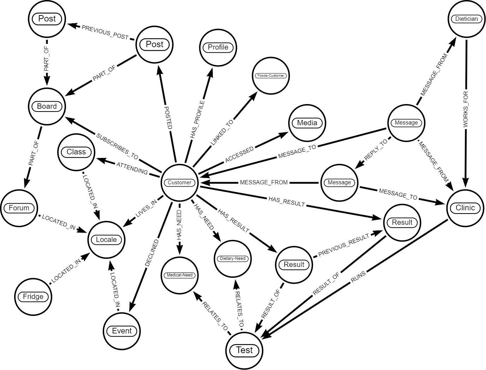

[> Home](../README.md)    [> Solution Background](README.md)
[< Prev](ArchitecturePatterns.md)  |  [Next >](Deployment.md)

---

# Datastore Solution Overview

When considering the Farmacy Foods system there are three needs for storing data

- general data storage and retrieval (e.g. profile data, event RSVPs, etc)
- analytics data storage, and analytics of stored data (i.e. the data under analysis, e.g. test results, and the results of that analysis)
- large, static content (e.g. videos)

The need for analytics of some data stored in Farmacy Family, and for potentially large files, means that more than one type of data store could be optimal for the system (polyglot persistence).

## Considered Data Store Approaches

### Relational

This type of data store is optimal for data that is not highly connected. The need to create relationships via extra tables and joins slows down the storage and retrieval of data and makes the design and maintenance more complex. **Simplicity is an inherent architecture characteristic.**

Relational is an option for data that is not highly connected and not involved in analytics.

### Document

This type of data store is also not optimal for data that is highly connected. It is good for data that is unstructured (not all the same), e.g. would not fit well into the tables in a relational database due to null entries in various columns in different rows.

Analysis of the data required for Farmacy Family may show that a document store would be optimal for all or some of the non-analytical or highly connected data, e.g. profiles (where some users fill in all fields and others only a selection).

### Blob

Binary Large Object storage is optimised for unstructured binary files that are large in size, e.g. videos and images. This would be the optimal type of storage for static content for Farmacy Family.

[ADR: 009 We-will-use-a-blob-storage-for-static-content](../4.ADRs/009-We-will-use-a-blob-storage-for-static-content.md)

### Graph

A graph database is optimal for highly connected data and can be very fast for performing analytics. It is also optimal for unstructured data, in the same way as a document store.

Without further analysis it would seem that a graph database would be optimal for the data that requires analytics and for also storing analytics of that data.

[ADR: 008 We-will-use-a-graph-store-for-analytics](../4.ADRs/008-We-will-use-a-graph-store-for-analytics.md)

## Graph Datastore Design Overview

The following diagram shows the initial design for the graph data store model. 

### Design Notes

- Even if an element, e.g. a large media file, will be stored in another way (e.g. blob storage) it can still be referenced and linked to in the graph data model, in order to link data in the graph store to elements outside of the graph store (e.g. a media node in the graph database would hold an identifier and/or link to a video file in blob storage).
- Date a time could be stored either as properties on a node or relationship, or as relationships to date/time nodes, or a mixture of both. This can be altered to tune performance when required.
- Properties of nodes and relationships are not shown on this high-level diagram.

### General Analysis

- The graph structure lends itself well to analytics due to the nature of matching patterns when querying the graph.
- Relationships between nodes can be tuned to allow different or faster analysis, e.g. a PREVIOUS_RESULT relationship is shown below, between two results, which makes ordering results much quicker than selecting all results for a test and then ordering by date.

### Medical Analysis

- The Customer has needs, which can be dietary or medical (other types of need could be added in the future if required).
  - Tests can then be linked to a Need, e.g. blood sugar levels to diabetes. This gives an easy way to link Tests a Customer could take to the Customer.
  - Analytics on numbers, location, etc, of Customers who have specific medical or dietary Needs are easy to run by simple pattern matching.
- Data that Clinics already have can be stored in the graph also, and used for analysis. (e.g. previous test results, not relating to any Customer, could be linked to a Test and to a Locale for analysis)

### Farmacy Foods Analysis

- A Fridge is located in a Locale. This means that analysis of e.g. dietary requirements linked to a Locale can then be applied to that Fridge by Farmacy Foods.
- This data could go further and link Ingredients and/or Meals to dietary and medical needs, and to a Fridge with an inventory relationship, to further add to analysis and recommendations for Farmacy Foods.

### Community: Classes, Events & Forums

- A Customer lives in a Locale, and a Class, Event and Forum are located in a locale. 
- A Customer can specify that they are attending or have declined an event. This provides a simple way to query events and classes: 
  - which a customer may be interested in attending (filtering out those that they have declined)
  - to display upcoming events or classes the customer plans to attend
  - to show a reminder of an event or class they are attending today!
- A Customer can subscribe to a Forum and post to a forum linked to their Locale. Posts are linked to a Forum. This provides a simple way to query forums and posts:
  - to show Forums the Customer may be interested in subscribing to or reading, connected to the Customer's Locale
  - to show Posts in a forum and order them quickly (using PREVIOUS_POST relationship), with indication of who posted them
  - to show Posts the Customer has created that have a reply (an incoming PREVIOUS_POST relationship)
- Extra relationships, e.g. ATTENDED or NO_SHOW, or properties on current relationships, e.g. attended: true/false on an ATTENDING relationship, could be added for analysis of this data.

### Messaging

- A Message can be sent by a Customer or Dietician.
  - A Customer sends a Message to a Clinic.
  - A Dietician works for a Clinic and can reply to a Message sent to the Clinic. (Security note: if a Dietician were to change the clinic they worked for they would only be able to access and reply to messages attached to their current Clinic. A WORKED_FOR relationship could be added for transparency.)
  - As the Dietician's Message is then linked to the original Message (REPY_TO) the Dietician can then be notified of any further messages in the chain, or another Dietician at the Clinic can answer a the new message in the chain.

## Next Steps

- [x] Create initial model for analytical data in a graph database.
- [ ] Analyse data needs to decide upon storage of non-analytical data: document, relational, or graph.
- [ ] Analyse analytical data needs to decide initial properties for the graph database nodes and relationships.
- [ ] Create model for storing of analytical results once the structure is known.

---

[> Home](../README.md)    [> Solution Background](README.md)
[< Prev](ArchitecturePatterns.md)  |  [Next >](Deployment.md)
