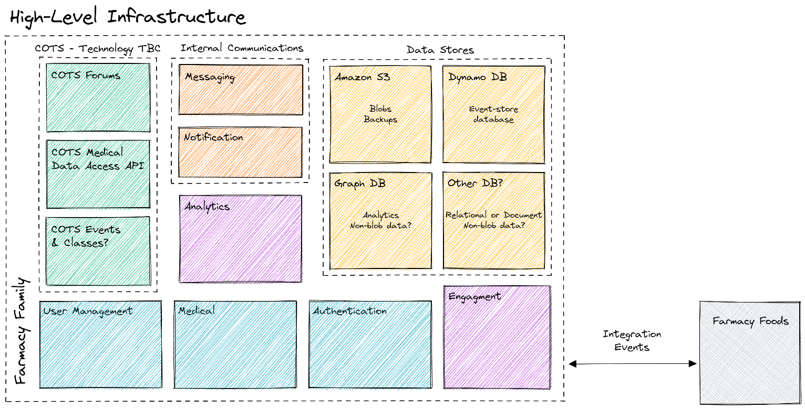
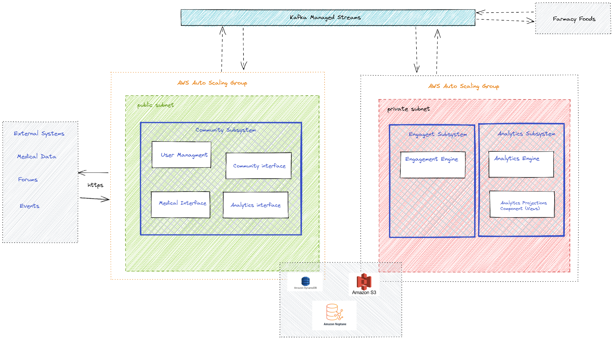

[> Home](../README.md)    [> Solution Background](README.md)
[< Prev](DataStore.md)  |  [Next >](Roadmap.md)

---

# Deployment

Deployment of the Farmacy Family system will be in line with the Farmacy Foods system.

## Infrastructure

The following diagram shows a very high-level infrastructure diagram, with some suggested technologies. The next stage will be a lower-level diagram focusing on Amazon technologies and infrastructure.

------
## AWS Deployment

The following diagram shows how the new components can be added to the Farmacy
system, extending the existing Farmacy Foods deployment by plugging into the Kafka streams
already deployed and running. Farmacy Family will extend the use of existing components
where possible to decrease the complexity of the Farmacy Family deployment.

The deployment has been designed in a similar manner to the Farmacy Foods for consistency.

[> Home](../README.md)    [> Solution Background](README.md)
[< Prev](DataStore.md)  |  [Next >](Roadmap.md)
