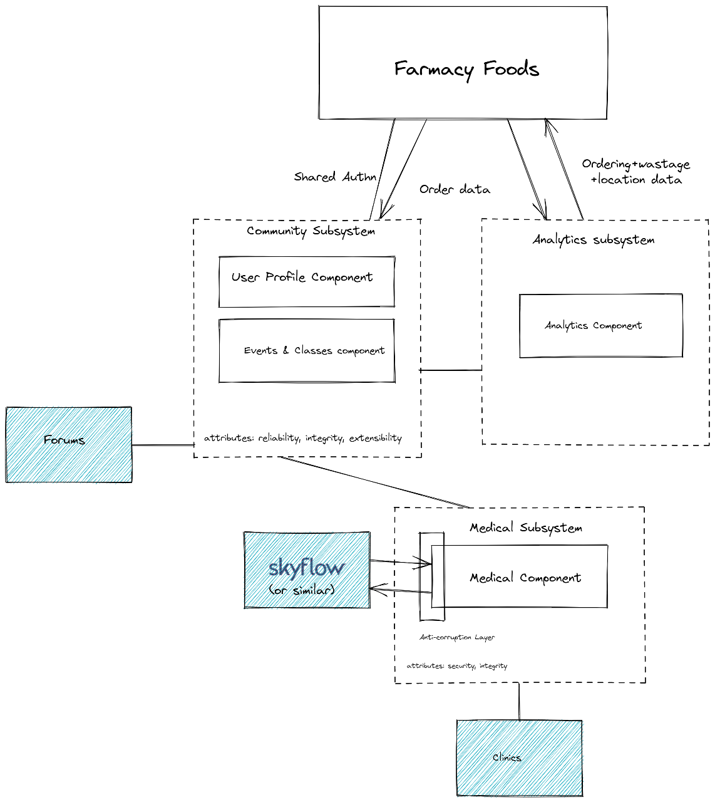

[> Home](../README.md)    [> Solution Background](README.md)
[< Prev](ArchitecturePatterns.md)  |  [Next >](Conceptual.md)

---

# Overview of System Approach

The below shows a high-level system approach to communication between systems and components. NOTE: the Farmacy Interface has been left out for brevity, along with authentication.

[> Home](../README.md)    [> Solution Background](README.md)
[< Prev](ArchitecturePatterns.md)  |  [Next >](Conceptual.md)