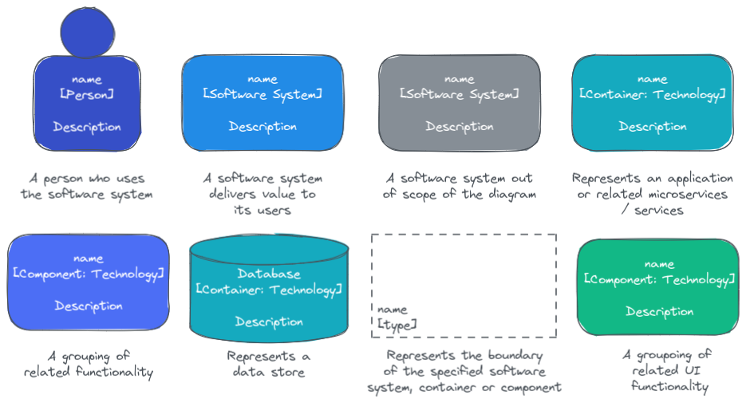
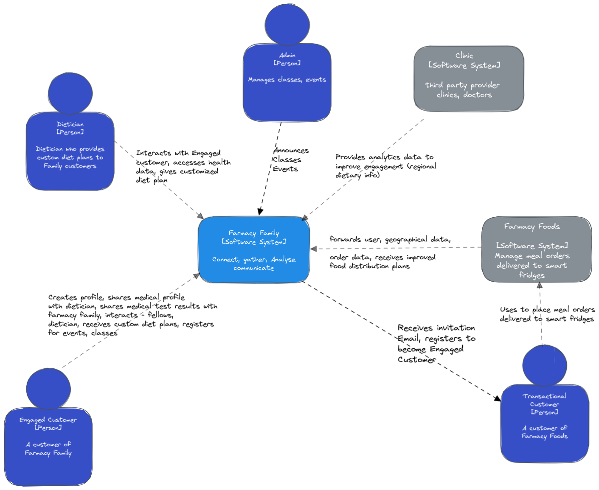
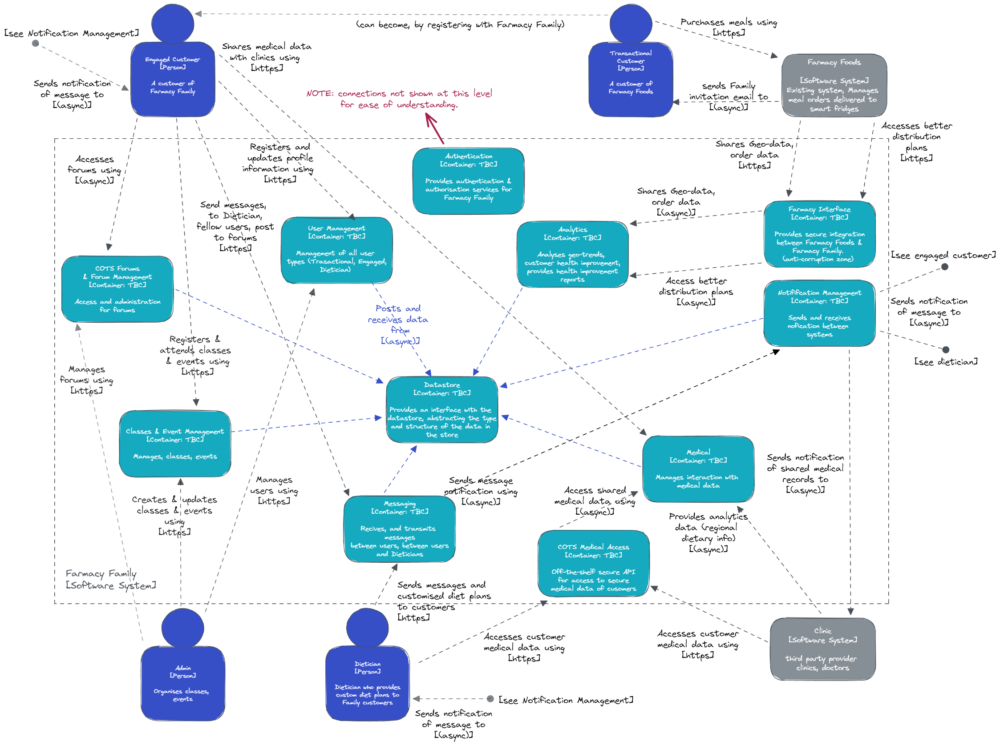
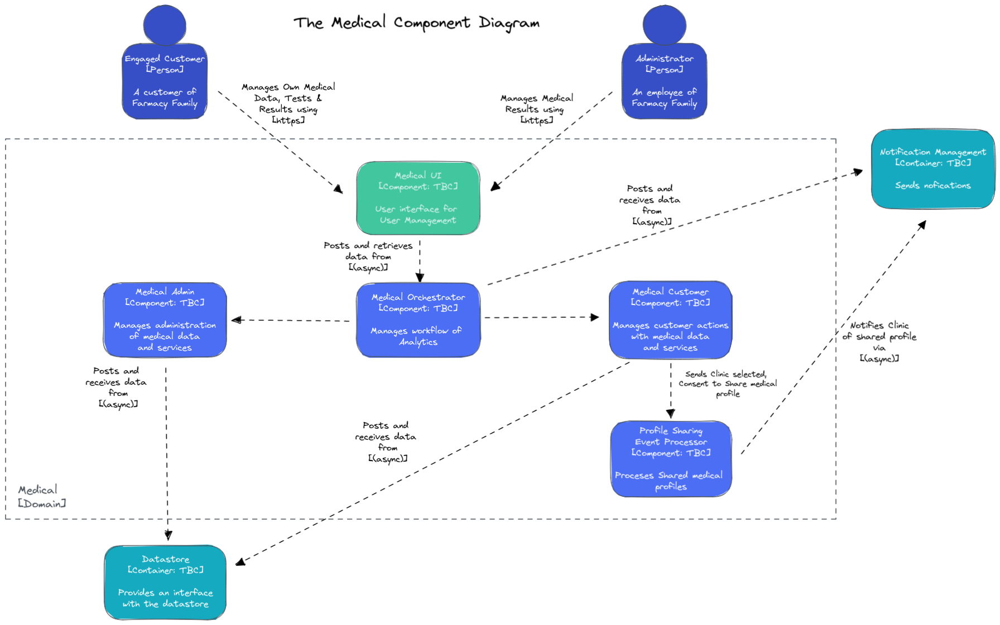
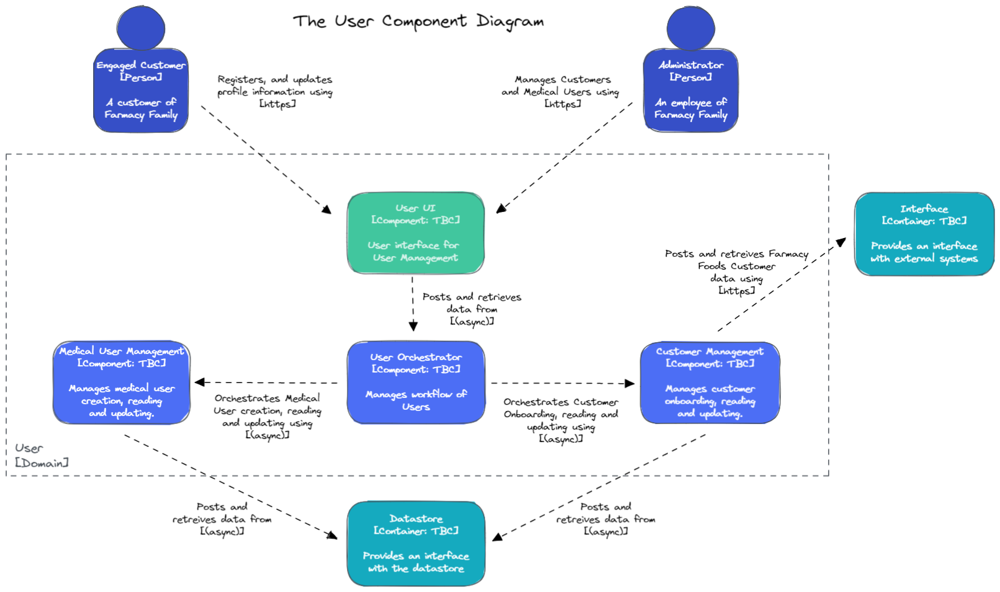

[> Home](../../README.md)    [> Views & Perspectives](../README.md)
[< Prev](../scenarios/README.md)  |  [Next >](../../README.md#resources)

---

# C4 Models

A C4 model is a common set of abstractions used to describe the static structure of a software system; these abstractions having four levels: **software system**, **containers**, **components** and **code**. **People** use the software system.

The following diagrams use the standard C4 notation.

## C4 Model Key

## Context Diagram (Level 1 - top level)

A **System Context** diagram provides a starting point, showing how the software system in scope fits into the world around it.[^](#expl) 
This diagram shows how the main users of Farmacy Family interact with the system, and the other systems that Farmacy Family system interacts with.

## Container Diagram (Level 2)

A Container diagram zooms into the software system in scope, showing the high-level technical building blocks.[^](#exp1) The following diagram breaks down the Farmacy Family system into groups of related functionality, or domains, and shows how they interact with each other and how the users of the system interact with the functionality.

## Component Diagrams (Level 3)

A **Component** diagram zooms into an individual container, showing the components inside it.[^](#expl)
The following diagrams break down the containers/functionality shown above further, into components which represent individually deployable services.

### Relevant ADRs

- [003 component-communication](../../4.ADRs/003-component-communication.md)
- [004 use-inbox-outbox-pattern](../../4.ADRs/004-use-inbox-outbox-pattern.md)

### Medical Management

The following diagram shows the individually deployable services in the Medical Management domain, and how they interact with each other, users and other domains.

#### Relevant ADRs

- [005 use-crypto-shredding](../../4.ADRs/005-use-crypto-shredding.md)
- [010 We-will-use-a-secure-data-solution](../../4.ADRs/010-We-will-use-a-secure-data-solution.md)
- [017 Separate the Medical domain](../../4.ADRs/017-We-will-split-medical-domain.md)

### User Management

The following diagram shows the individually deployable services in the User Management domain, and how they interact with each other, users and other domains.

#### Relevant ADRs

- [011 Separate the User domain](../../4.ADRs/011-We-will-separate-the-user-domain.md)
- [019 Use Authentication and Authorisation for human-system integration](019-use-auth-for-human-system-integration.md)

## Next Steps

- [ ] Add Analytics Management
- [ ] Add Events Management
- [ ] Add Datastore Management
- [ ] Add Messaging Management

---

^ explanations from https://c4model.com/

---

[> Home](../../README.md)    [> Views & Perspectives](../README.md)
[< Prev](../scenarios/README.md)  |  [Next >](../../README.md#resources)