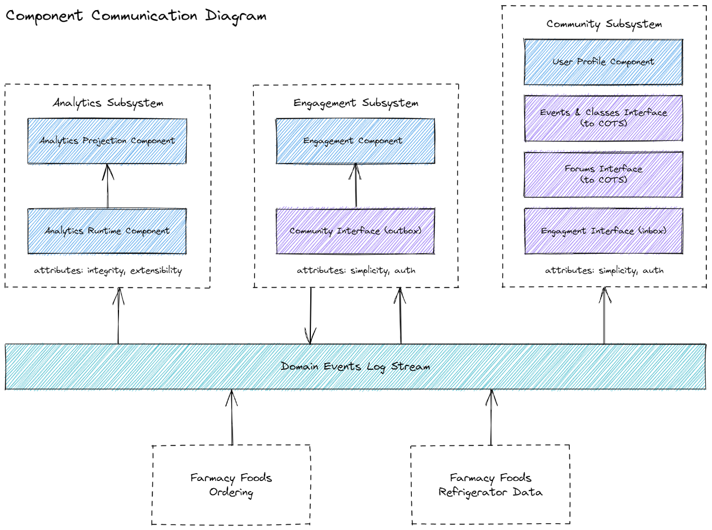

[> Home](../../README.md)    [> Views & Perspectives](../README.md)
[< Prev](../README.md)  |  [Next >](../EventStorming/README.md)

---

# View of Component Communication Between Foods And Family

This gives an overview of how data is being passed between the existing Farmacy Foods system and the new component created as part of the Family extension

The existing solution already leverages a log stream as a means of aysnc communication between its boundaries. This will mean integration events can be easily introduced.
This will require extending the current solution to emit events that must include more information such as the source of the event and payload type etc.
As a result of this we should use cloud events. See [ADR003- Component Communication](../../assets/diagrams/FunctionalView.png)

---

## Interesting integration points

* **Farmacy Foods Ordering** - Farmacy foods is already emitting domain events . This should be extended to produce integration events.
  * With information such as order contents, profile data, location data etc this will be a powerful mechanism for the analytics component and will be used to enable more efficient fridge content placement
  * Engagement component could be extended to use this to understand information about transactional to provide a more customised experience for onboarding
* **Farmacy Foods Refridgerator Data** - Data such as wastage events
  * Events such as wastage events can be used by the analytics component to further the effectiveness of fridge content placement and decrease wastage

[> Home](../../README.md)    [> Views & Perspectives](../README.md)
[< Prev](../README.md)  |  [Next >](../EventStorming/README.md)
