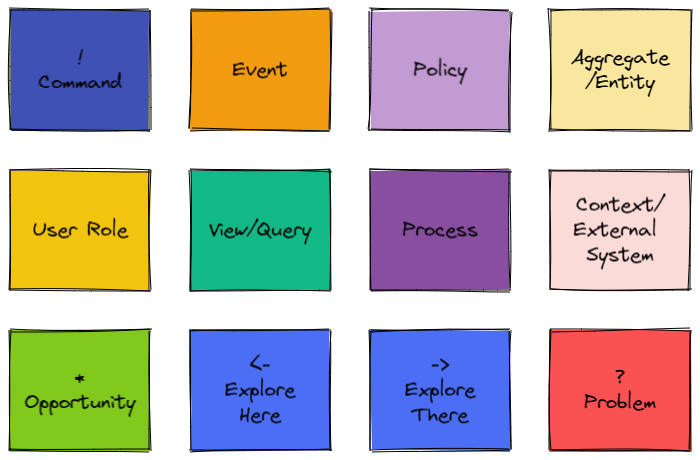
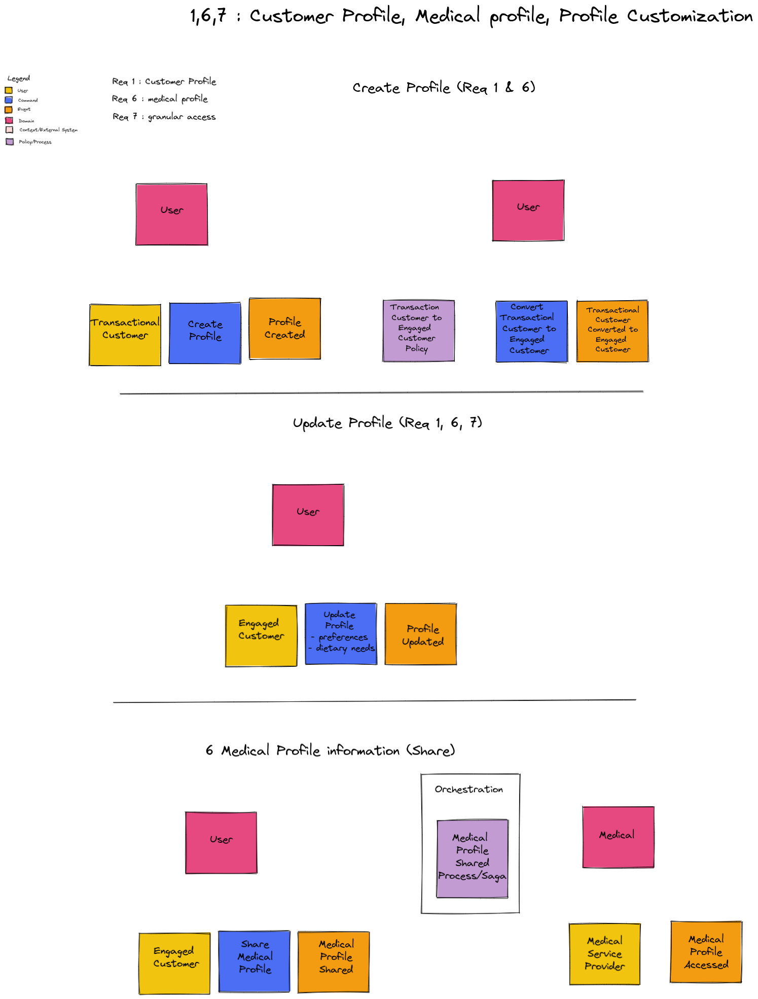
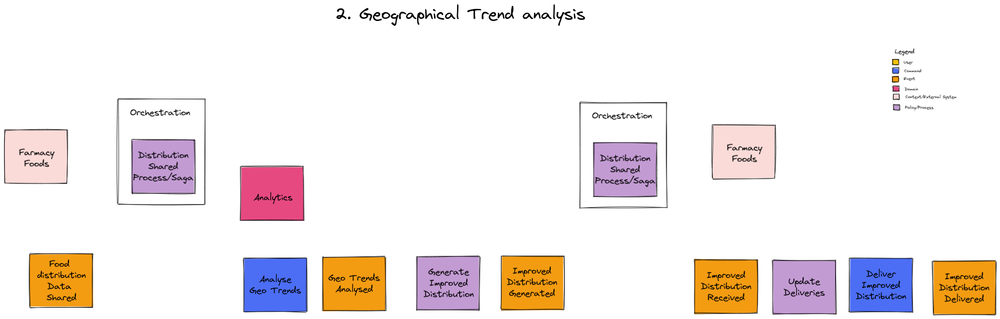
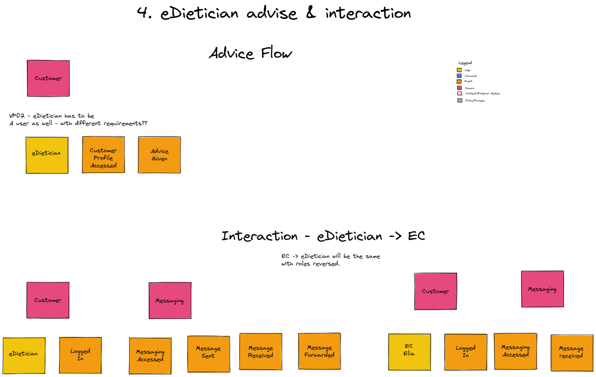
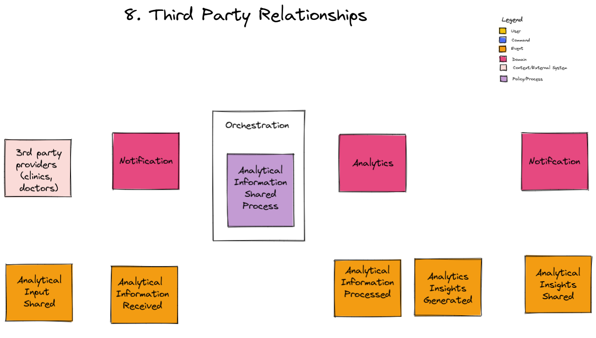
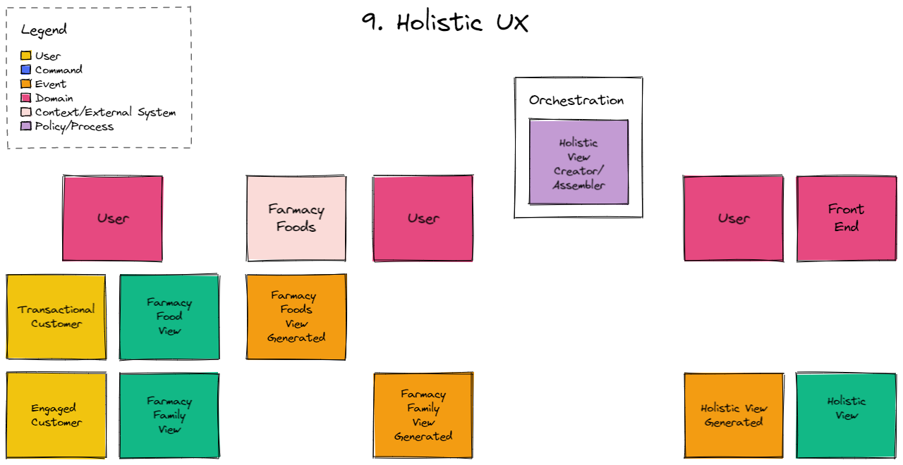
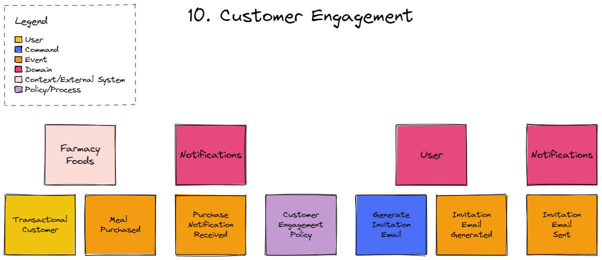

[> Home](../../README.md)    [> Views & Perspectives](../README.md)

---

# EventStorming

EventStorming as described at the [source](https://www.eventstorming.com/)
'*is a flexible workshop format for collaborative exploration of complex business domains*'.

It is used in many scenarios of which the following are of interest to us.

* to explore the viability of a new startup business model;
* to envision new services, that maximise positive outcomes to every party involved;
* to design clean and maintainable Event-Driven software, to support rapidly evolving businesses.

We have used this technique to identify the Domain Events that are evident in the system.

We've gone through each of the 10 initial requirements to come up with the business flow required to satisfy the requirement. The key element of the business flow is the event. Please note that this is not an exact process, and it is only used to clarify the concepts involved in the business processes.

Standard coloured boxes are used to draw these diagrams.

It is enough to keep the following in mind to understand these diagrams

1. The orange boxes represent Domain Events.
2. The blue boxes represent Commands (which result in a Domain Event).
3. The yellow boxes represent Users.
4. The colored boxes are placed on a time line. 

# The Key

The requirement numbers used here match those used in [Business Goals and Requirements](../../1.ProblemBackground/BusinessGoalsRequirements.md)

# Requirements #1, #6, and #7 : Customer Profile, Medical Profile, Profile Customization

# Requirement #2 

# Requirement #4

# Requirement #8

# Requirement #9

# Requirement #10

---

[> Home](../../README.md)    [> Views & Perspectives](../README.md)