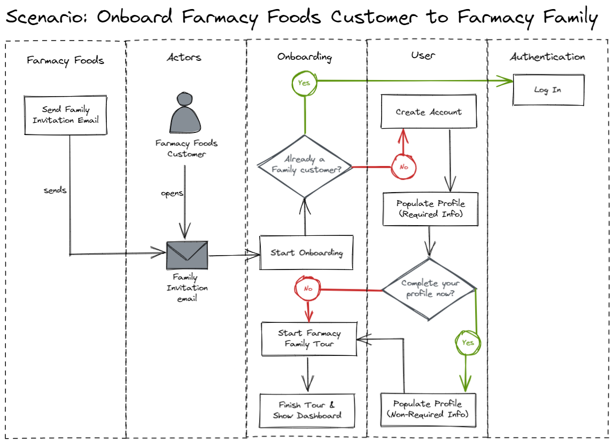
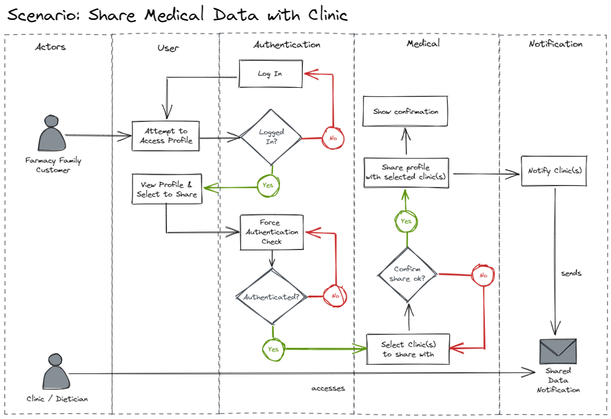
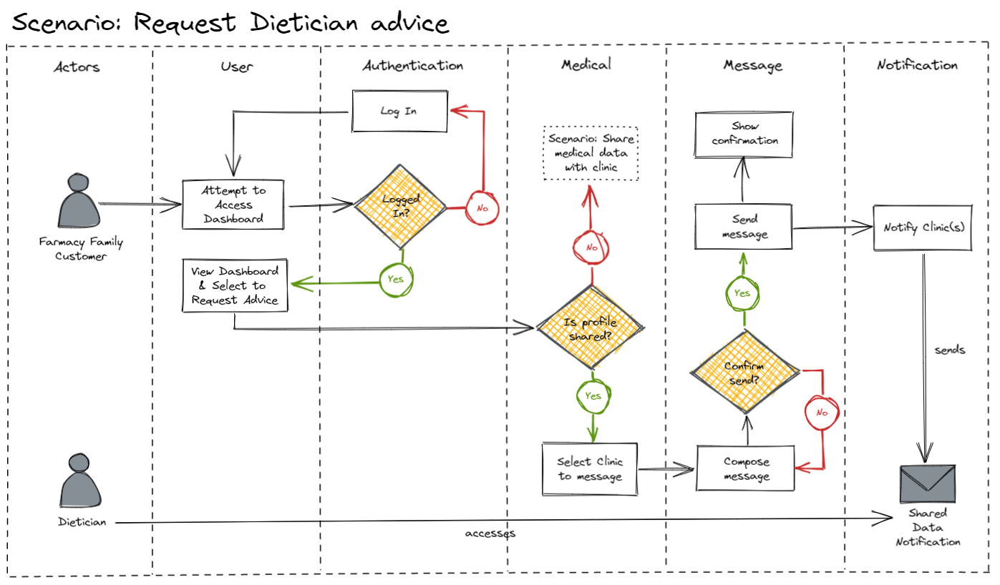

[> Home](../../README.md)    [> Views & Perspectives](../README.md)
[< Prev](../EventStorming/README.md)  |  [Next >](../C4Models/README.md)

---

# Architecturally Significant Scenario Flow Diagrams

The following are the most architecturally significant scenarios/flows, derived from the Actors and Actions above, which will shape the architecture of the Farmacy Family system.

## 01  Onboard Farmacy Foods Customer to Farmacy Family

A Transactional Customer (Farmacy Foods customer) joins Farmacy Family to become an Engaged Customer.

## 02  Share Medical Data with Clinic

An Engaged Customer (Farmacy Family customer), chooses to share their medical data with a specific Clinic.

## 03 Request Dietician Advice

An Engaged Customer (Farmacy Family customer) requests advice from a Clinic, based on the Engaged Customer's medical profile.

---

[> Home](../../README.md)    [> Views & Perspectives](../README.md)
[< Prev](../EventStorming/README.md)  |  [Next >](../C4Models/README.md)