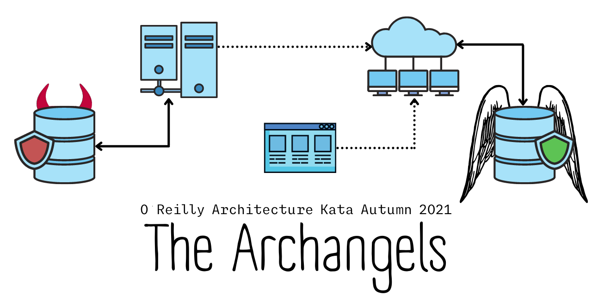

# Architectural Kata Autumn 2021 - The Archangels

Welcome to our entry to the O'Reilly Spring 2021 Architectural Kata. The aim of this documentation repository is to communicate our design for the problem described, for a stakeholder and development team audience.

## Members
- Jacqui Read [[LinkedIn](https://www.linkedin.com/in/jacquelineread/)]
- John McCarthy
- Luke Gee [[LinkedIn](https://www.linkedin.com/in/luke-gee-nbyuk/)]
- Shenal Silva
- Vikram Pawar[[LinkedIn](https://www.linkedin.com/in/vikrammpawar/)]

## Solution Structure

[Clarifications](Clarifications.md)

[Glossary](Glossary.md)

[Problem Background](1.ProblemBackground/README.md)

- [Business Goals, Requirements & Opportunities](1.ProblemBackground/BusinessGoalsDriversAndRequirements.md)
- [Architecture Analysis](1.ProblemBackground/ArchitectureAnalysis.md)
- [Actors and Actions](1.ProblemBackground/Personas.md)
- [Constraints & Assumptions](1.ProblemBackground/ConstraintsAndAssumptions.md)
- [Stakeholder Concerns](1.ProblemBackground/StakeholderConcerns.md)
- [RAID Log](1.ProblemBackground/RAID.md)

[Solution Background](2.SolutionBackground/README.md)

- [Architecture Principles](2.SolutionBackground/ArchitecturePrinciples.md)
- [Overall Architecture Style Analysis](2.SolutionBackground/ArchitecturePatterns.md)
- [Datastore Solution Overview](2.SolutionBackground/DataStore.md)
- [Deployment](2.SolutionBackground/Deployment.md)
- [ADRs](4.ADRs/README.md)

[Views & Perspectives](3.ViewsAndPerspectives/README.md)

- [Functional View](3.ViewsAndPerspectives/FunctionalView/README.md)
- [Event Storming](3.ViewsAndPerspectives/EventStorming/README.md)
- [Scenario Flow Diagrams](3.ViewsAndPerspectives/scenarios/README.md)
- [C4 Models](3.ViewsAndPerspectives/C4Models/README.md)

## Resources

- [2021 Architecture Katas Presentation](assets/docs/2021-fall-kick-off.pdf)
- [2021 Kata Participating Teams Info](assets/docs/participating-teams-info-katas-fall-2021.pdf)

## References

- [Using logs to build a solid data infrastructure (or: why dual writes are a bad idea)](https://martin.kleppmann.com/2015/05/27/logs-for-data-infrastructure.html)
- [Architectural Katas 2020 Fall - Group ArchColider](https://github.com/ldynia/archcolider)
- [Architectural Kata Spring 2021 - The Mad Katas](https://github.com/tekiegirl/TheMadKatas) (Jacqui Read's previous kata entry)
- [C4 Model](https://c4model.com/)
- [EventStorming](https://www.eventstorming.com/)
- [Sky flow data privacy vault via a simple API](https://www.skyflow.com/)  
